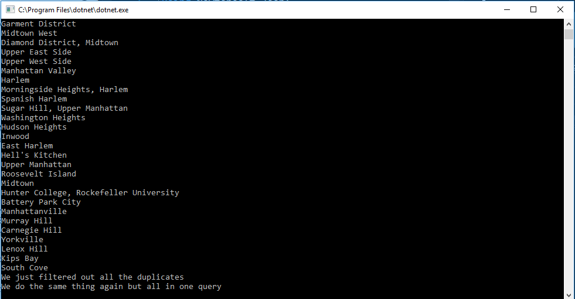

# Lab08_LINQ_in_Manhatten
A console application to read JSON file convert them to C# objects and filter them out using LINQ.

## What you need
* Install the latest Visual Studio 2017
* Have Windows OS on your device

## How to Open App
* Fork the Lab08_LINQ_in_Manhatten repo from [my GitHub Page](https://github.com/Calamario)
* Git Clone the repo onto your local device
* Open .sln file with Visual Studio
* Click on the green arrow to start
* Navigate through the menu on your console

## Other Details
* newtonsoft JSON.NET has been added to NuGet to assit in creating this application
* special thanks to json2csharp for outlining the necessary class

## What it looks like

